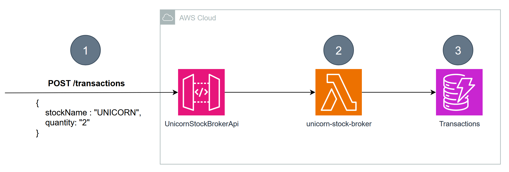

# Java on AWS Lambda Workshop

This project contains the code for the Java on AWS Lambda workshop.
You can find the content and instructions for the workshop [here](https://catalog.workshops.aws/java-on-aws-lambda).

You will learn how to build cloud-native Java applications, best practices and performance optimizations techniques and how to migrate your existing Java application to AWS Lambda.

# Architecture & Lab Overview

## [From Serverful to Serverless Java with AWS Lambda](labs/unicorn-store)

In this module you will learn how to bring your traditional Java Spring application to AWS Lambda with minimal effort and iteratively apply optimizations to get the best out of your Serverless Java experience. You will get an overview of best practices, performance trade-offs and the design considerations for each step to be able to make well-informed decisions when bringing enterprise Java applications to AWS Lambda.

## [Accelerate Serverless Java with GraalVM](labs/unicorn-location-api)

In this module you will create an application in plain Java and apply AWS Lambda Java best practises.
The goal is to understand how you can optimize your Java applications and run it more efficiently.
In addition, we’ll introduce GraalVM native images and modify the existing application to gain up to 80% performance improvement during cold-starts.

## [Starting up faster with AWS Lambda SnapStart](labs/unicorn-location-api)

In this module you will learn how SnapStart addresses Java function performance. You will learn how to enable SnapStart with infrastructure as code, how to customize your snapshot behavior with runtime hooks and identify potential refactoring areas with automated tooling. Lastly, you will apply additional best practices for performance tuning and snapshot creation. After this module you will be able to make well-informed decisions when using SnapStart for your Java based AWS Lambda functions.

## Security

See [CONTRIBUTING](CONTRIBUTING.md#security-issue-notifications) for more information.

## License

This library is licensed under the MIT-0 License. See the LICENSE file.

