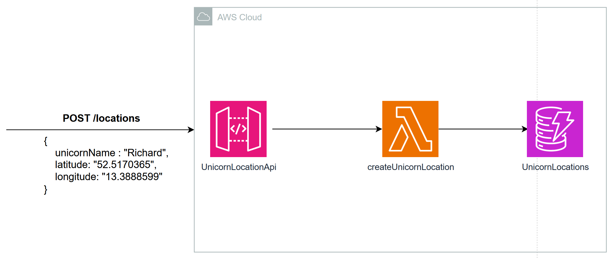

# Java on AWS Lambda Workshop

This project contains the code for the Java on AWS Lambda workshop.
You can find the content and instructions for the workshop here: TODO: Update Link

You will learn how to build cloud-native Java applications, best practices and performance optimizations techniques and how to migrate your existing Java application to AWS Lambda.

# Architecture & Lab Overview

## [01 - Migrate - Unicorn Store](labs/unicorn-store)

In this module you will learn how to migrate an existing Spring Boot application to AWS Lambda.
You will understand the implications, tools and optimizations techniques to adapt your application to the new requirements.

## [02 - Optimize - Unicorn Location API](labs/unicorn-location-api)

In this module you will create an application in plain Java and apply AWS Lambda Java best practises.
The goal is to understand how you can optimize your Java applications and run it more efficiently.

## [03 -Accelerate - Unicorn Location API](labs/unicorn-location-api)

In this module you will explore GraalVM and learn how to reduce your cold-start by up to 80%.

## Security

See [CONTRIBUTING](CONTRIBUTING.md#security-issue-notifications) for more information.

## License

This library is licensed under the MIT-0 License. See the LICENSE file.

