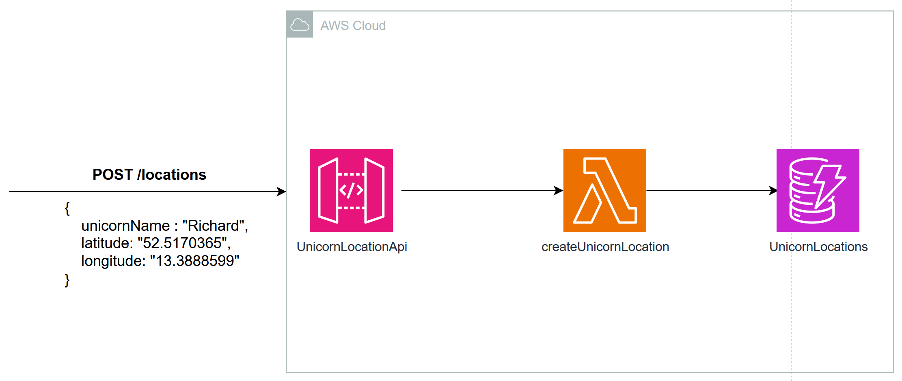

# Lab 2 - Optimize your Serverless Java application

# Pre-Requisites

1. Install [AWS SAM](https://docs.aws.amazon.com/serverless-application-model/latest/developerguide/serverless-sam-cli-install.html)
2. Install [AWS CLI](https://docs.aws.amazon.com/cli/latest/userguide/getting-started-install.html)
3. Install [jq](https://stedolan.github.io/jq/download/)
4. Install [artillery](https://www.artillery.io/docs/guides/getting-started/installing-artillery)

# Architecture overview

After you have learned how to migrate your existing Unicorn Store Spring Boot application in the [Migration section](../unicorn-store), you are now going to build a net new **Unicorn Location Service**.

This service will receive coordinates from Unicorns all over the world. In the following diagram you will see the architecture you are going to build.

- (1) You can interact with the service via a REST-API that provides a **POST /locations endpoint** to create new location records

- (2) API Gateway integrates with the createUnicornLocation Lambda function

- (3) The Lambda function stores the records in Amazon DynamoDB

# Lab stages

1. Minimal logging
2. Minimal serialization
3. AWS SDK best practises
4. Tiered compilation
5. Common Runtime Client
6. Accelerate - Use GraalVM to reduce your cold-starts by up to 80%