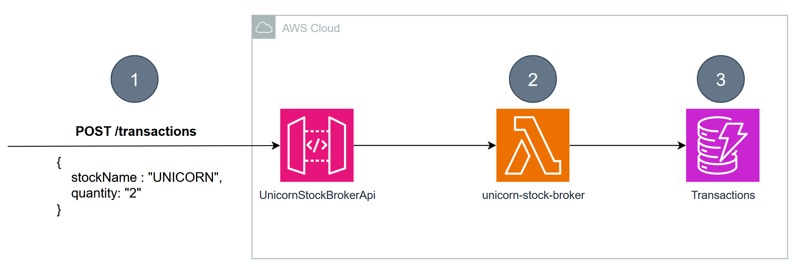

# Starting up faster with AWS Lambda SnapStart

This is the application blueprint (starting point) for the AWS Lambda SnapStart workshop. Please navigate to the workshop instructions to run the workshop.

# Pre-Requisites

1. Install [AWS CDK](https://docs.aws.amazon.com/cdk/latest/guide/getting_started.html)
2. Install [AWS CLI](https://docs.aws.amazon.com/cli/latest/userguide/getting-started-install.html)
3. Install [jq](https://stedolan.github.io/jq/download/)
4. Install [artillery](https://www.artillery.io/docs/guides/getting-started/installing-artillery)

# Architecture overview

Throughout this workshop we are going to work with an example application named **Unicorn Stock Broker**.

The Unicorn Stock Broker is a **Spring Cloud Function Application** that provides an API to create transactions.

(1) You can interact with the service via a REST-API through Amazon API Gateway that provides a POST /transactions endpoint to create new transaction records

(2) API Gateway forwards the request to the unicorn-stock-broker Lambda function. The function adds additional data such as a BROKER_ID (function instance that wrote the record) and a random transaction id to the record.

(3) Finally, the Lambda function stores the transaction in the Transactions Amazon DynamoDB table.
