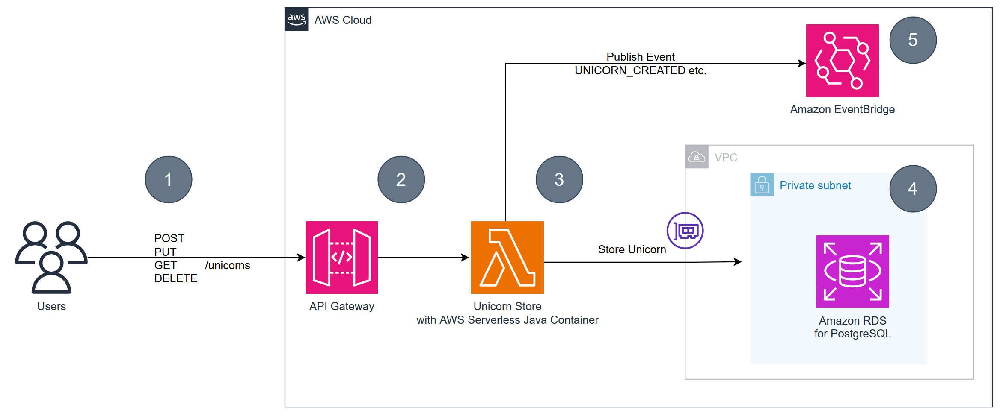

# Migrate your Spring Boot application to AWS Lambda

# Pre-Requisites

1. Install [AWS CDK](https://docs.aws.amazon.com/cdk/latest/guide/getting_started.html)
2. Install [AWS CLI](https://docs.aws.amazon.com/cli/latest/userguide/getting-started-install.html)
3. Install [jq](https://stedolan.github.io/jq/download/)
4. Install [artillery](https://www.artillery.io/docs/guides/getting-started/installing-artillery)

# Architecture overview

Throughout this workshop we are going to work with an example application named **UnicornStore**.

The UnicornStore is a **Spring Boot Java Application** that provides CRUD-Operations for Unicorn-Records.
It stores them in a relational database (Postgres) and publishes and event afterwards in an eventbus (EventBridge).


## Stage 01: AWS Serverless Java Container
The following diagram shows the outcome after applying the instructions of the first lab:



- (1) End-User can interact with the service via a REST-API that provides basic CRUD operations

  **POST /unicorns**          - Create a new unicorn  
  **PUT /unicorns/{id}**     - Update an existing uncicorn   
  **GET /unicorns/{id}**      - Retrieve an existing unicorn  
  **DELETE /unicorns/{id}**   - Delete an existing unicorn

- (2) The API Gateway proxies the request to the Lambda Function

- (3) The application communicates with the database and the eventbus. Depending on the service this can be in the same VPC or within the AWS Network.


## Stage 02: Spring Cloud functions

You will migrate your existing application to work with Spring Cloud functions and understand the differences in design and performance.

## Stage 03: Alternatives

You will look at alternatives such as compile-time frameworks & an implementations without a framework to understand the implications.

## Setup

The following script will build the infrastructure stack via AWS CDK.

```bash
./setup-infrastructure.sh
```

To deploy the different applications use:

```bash
./deploy.sh spring #(or basic, micronaut)
```

To run a load test for the Spring-App use the following script:
```bash
./benchmark.sh spring #(or basic, micronaut)
```

